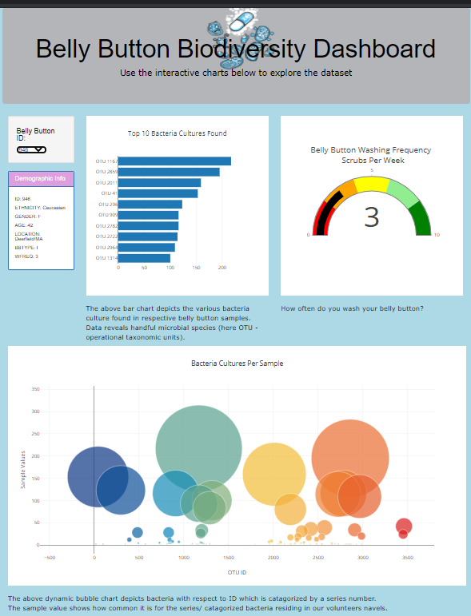

# Plotly_BellyButtonDiversity
## Overview and purpose
- To assist in building an interactive dashboard using Plotly.js to explore data on the biodiversity of belly buttons.

## Resources
- VS Code
- Web browser Chrome
- Project data (samples.json)

## Summary 
- consolidating the information data from the volunteer's navel samples into an interactive dashboard:
    - Demographics panel with dropdown ID numbers (Belly Button ID's) - location, age, sex 
    - Visualize the bacteria data for each volunteer - Bar Graph showing top 10 Bacteria species in their bellies
    - Volunteers can identify wether the species of bacteria that Improbable Beef identifies a species that can synthesize good tasting beef.
    - Volunteers can also see in a colorful indicator display of washing their belly button frequency. 

                 